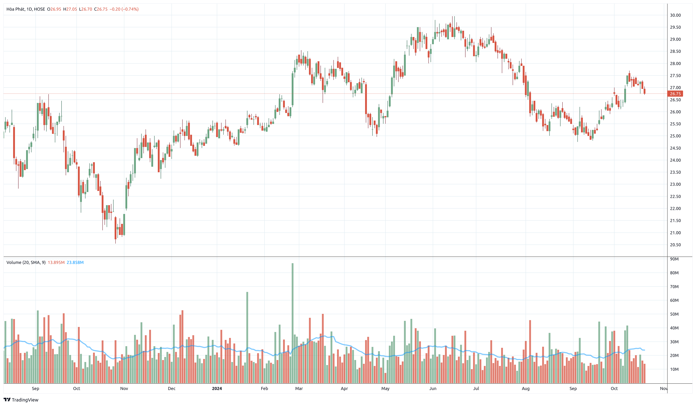

# Stock Analysis Project

## Overview
This project is a stock analysis application that provides chart analysis and data management for stock market information. It uses FastAPI for the backend, PostgreSQL for data storage, and integrates with VNDirect for chart data.

## Features
- User authentication
- Chart analysis for stocks
- Data management for company information
- Admin functionalities

## Tech Stack
- Backend: FastAPI
- Database: PostgreSQL
- Containerization: Docker
- Web Scraping: Selenium
- Chart Data: VNDirect

## Setup and Installation
1. Clone the repository
2. Install Docker and Docker Compose
3. Run `docker compose up --build` to start the application

## Project Structure
- `app/`: Main application directory
  - `src/`: Source code
    - `chart/`: Chart analysis functionality
    - `dataset/`: Data insertion and management
    - `internal/`: Internal admin routes
    - `routers/`: API routes
  - `main.py`: Application entry point
- `run.sh`: Script to run the Docker containers

## API Endpoints
- `/api/auth`: Authentication routes
- `/api/chart-analysis`: Chart analysis routes
- `/api/admin`: Admin routes

## Database
The project uses a PostgreSQL database with a `companies` table to store stock information.

## Chart Example

## Contributing
Please read CONTRIBUTING.md for details on our code of conduct and the process for submitting pull requests.

## License
This project is licensed under the MIT License - see the LICENSE.md file for details.
